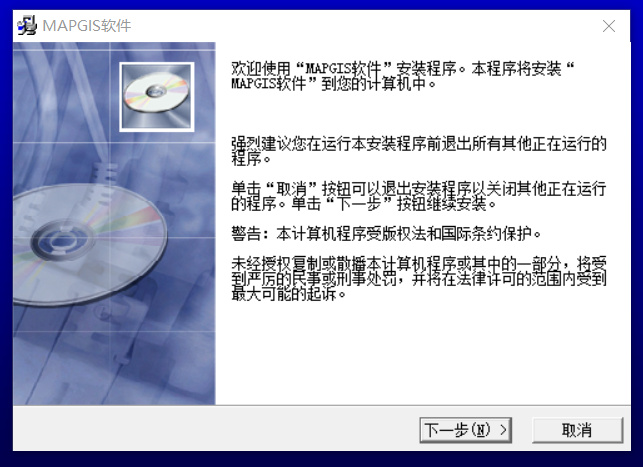
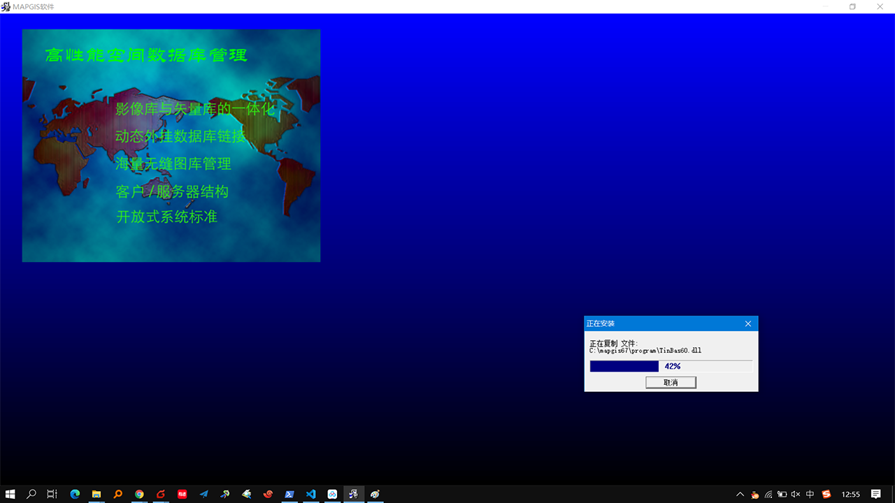
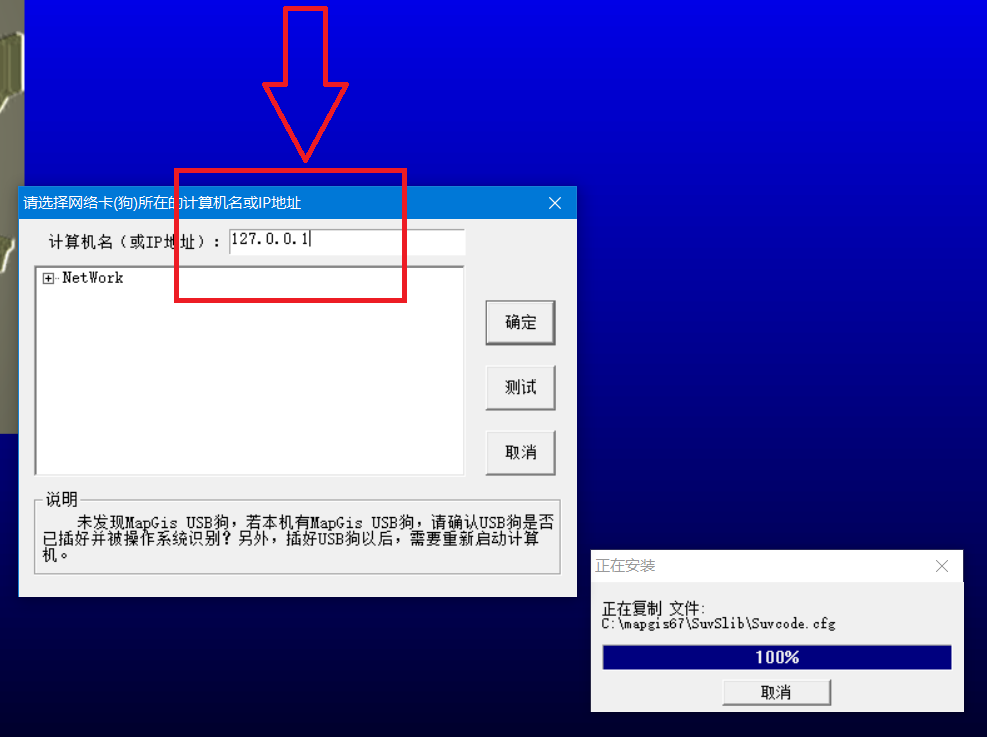
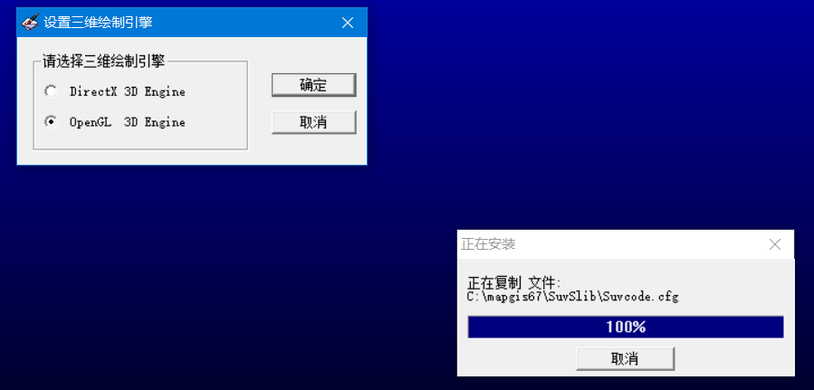
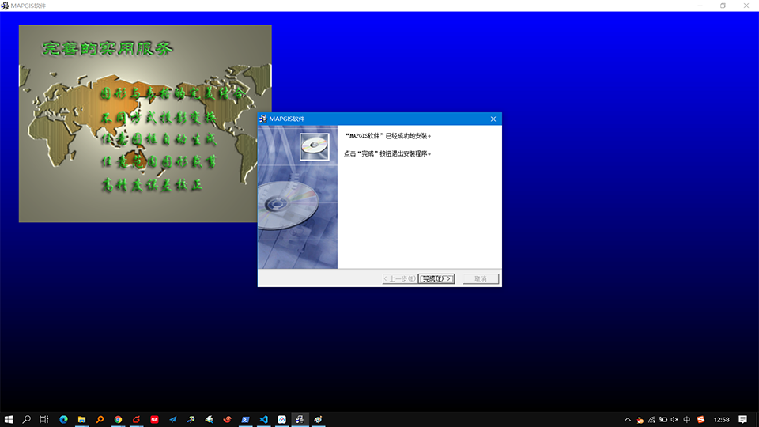
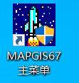

# MapGIS安装 (45分钟)

1. 下载并解压，链接 [百度网盘](https://pan.baidu.com/s/1OUw4IkpgwhjY8RlhL7zcYA) 提取码：`vbox` 
2. 双击运行`MapGIS` 安装程序 `Setup67.EXE`
    
3. 点击下一步
    
4. 直到弹出如下界面 计算机名或者IP地址填入 `127.0.0.1` 。如果填入IP地址失败，则尝试填入自己的计算机名 **（右键此电脑-查看设备名称）** 。
    
5. 双击运行虚拟狗 `DogServer67.exe`
    右下角出现虚拟狗图标，点击确定
    
6. 弹出三维绘制引擎选择 `OpenGL 3D`，确定
    
7. 弹出如下界面，点击完成，安装成功。
    
8. 桌面上双击如下图标，打开 `MAPGIS67主菜单`  
    
