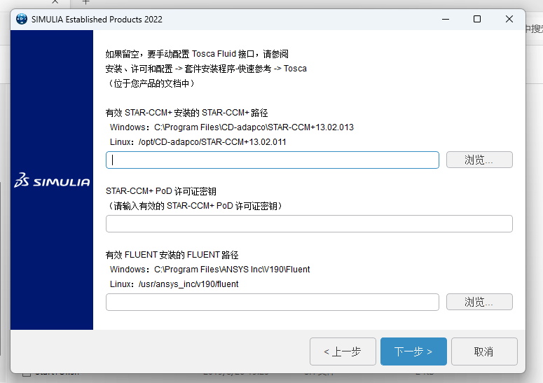

# Abaqus 2022 安装

## 注意事项 

- 安装过程中，**不要使用中文目录**。
- **建议都安装到C盘**。安装到其他盘，如果无法打开，请卸载后，安装到C盘。
- 安装前关闭杀毒软件。

## 下载并解压
1. 下载压缩包 `DS.SIMULIA.Suite.2022.Win64.zip.001` 和 `DS.SIMULIA.Suite.2022.Win64.zip.002` ，  下载链接 [百度网盘](https://pan.baidu.com/s/1PsngafqtjtIT50FucetsCg?pwd=zdem) 提取码：`zdem` 
2. 右键 `DS.SIMULIA.Suite.2022.Win64.zip.001` 解压出文件夹`DS.SIMULIA.Suite.2022.Win64` ，*注意 DS.SIMULIA.Suite.2022.Win64.zip.001 和 DS.SIMULIA.Suite.2022.Win64.zip.001 为 DS.SIMULIA.Suite.2022.Win64 分卷压缩（为了保证每个压缩包小于4G）得到，它俩共同出现才能解压出了 DS.SIMULIA.Suite.2022.Win64，* **所以只需解压一次即可。**
	
	
## 安装软件许可证

1. 首先设置环境变量，鼠标右键点击桌面此电脑，选择属性  
	
2. 打开高级系统设置，点击环境变量，在系统变量下点击新建，输入变量名：NOLICENSECHECK,变量值：true，点击确定
	
3. 进入 `./DS.SIMULIA.Suite.2022.Win64/solidSQUAD_` 文件，解压 SSQ_UniversalLicenseServer_Core_20180127074300.zip 和 SSQ_UniversalLicenseServer_Module_DSSimulia_20201125092500.zip
		
4. 运行破解文件
	- 将 `.\SSQ_UniversalLicenseServer_Module_DSSimulia_20201125092500\Vendors` 文件夹复制到  `./SSQ_UniversalLicenseServer_Core_20180127074300/SolidSQUAD_License_Servers` 文件夹中，
	- 然后将  `./SSQ_UniversalLicenseServer_Core_20180127074300/SolidSQUAD_License_Servers` 文件夹复制到 `C:/abaqus` （**必须复制到C盘abaqus下**）文件夹 （如没有该文件夹，自行创建）。
	- 右键以管理员身份运行 `install_or_update.bat` （文件类型： windows批处文件）。
	
5. 等待，破解完成出现如下图所示，按任意键继续...，即完成破解。
	

## 安装Abaqus
1. 右键用windows资源管理器打开 `DS.SIMULIA.Suite.2022.Win64.iso` ，将其装载到了虚拟光驱。
	
2. 以管理员身份运行 `./1/setup.exe` 安装程序
	  
3. 点击下一步  
	
4. 采用默认选择，点击下一步  
	
5. 点击安装  
	
6. 安装过程中，弹出如下图所示界面，点击浏览，选择文件2。
	
7. 点击确定  
	
8. 选择安装的目录，点击下一步。
	
9. 选择如图所示的选项，点击下一步
	
10. 按照默认选项，点击下一步。
	
11. 输入27800@localhost，点击下一步。
	
12. 选择设置安装的目录，点击下一步
	
13. 点击下一步
	
	
14. 默认，点击下一步。
	
15. 点击下一步
	
16. 点击安装
	
17. 点击continue
	
18. 点击关闭
	
19. 点击浏览，选择文件夹3，点击确定
	
	
	
20. 选择安装目录 `C:\SIMULIA\EstProdudts\2022` ，点击下一步。
	
21. 全选，点击下一步。
	
22. 点击安装
	
23. 点击关闭
	
24. 选择目录，点击下一步
	
25. 全部选择，点击下一步
	
26. 点击下一步
	
27. 点击下一步
	
28. 点击下一步
	
29. 点击安装
	
30. 点击关闭
	
31. 安装完成，点击关闭
	
## 运行软件
1. 在开始菜单中找到Abaqus CAE，点击打开
	
2. 打开后，软件界面如下图
	
## Abaqus软件汉化
1. 在文件夹 `C:\SIMULIA\EstProducts\2021\win_b64\SMA\Configuration` 中，找到 `locale.txt` 文件
	
2. 用记事本打开 `locale.txt` ，加入一行 `Chinese (Simplified)_China.936 = zh_CN` (**注意 Chinese 后有一个空格！**) ，然后将 `zh_CH=0` 改为 `zh_CH=1` ，然后保存，关闭。
	
3. 再次打开软件，显示界面如下图，即成功汉化。
	

**致谢：** 池禹（Abaqubs）