## 视频教程

- [ArcGIS入门教程](https://www.bilibili.com/video/BV1oE41137vm/?share_source=copy_web&vd_source=a6427384848e8aaa4034a801f47d4fb2&t=0)

## 1 下载
- 下载链接 [百度网盘](https://pan.baidu.com/s/1Z3BblT2wQYlHv17lza0r7Q?pwd=zdem) 提取码：`zdem` 
- 解压，得到如下图所示文件。
	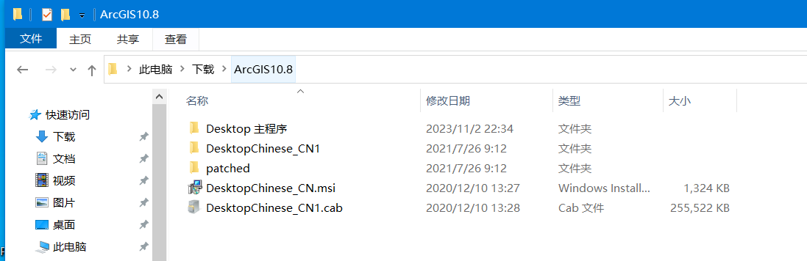
- 目录结构如下
	+ **Desktop 主程序** # *ArcGIS安装程序 Setup.exe 所在目录*
	+ DesktopChinese CN1
	+ patched
	+ **DesktopChinese CN.msi** # *汉化程序*
	+ DesktopChinese CN1.cab

## 2 安装
- 双击安装程序 `.\Desktop 主程序\Setup.exe` , 约15分钟后，完成安装 `ArcGIS`
	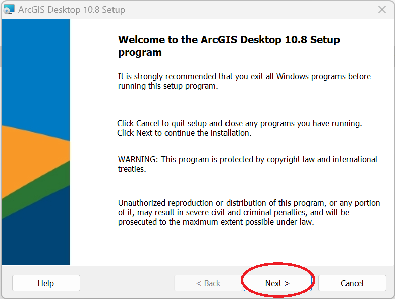
	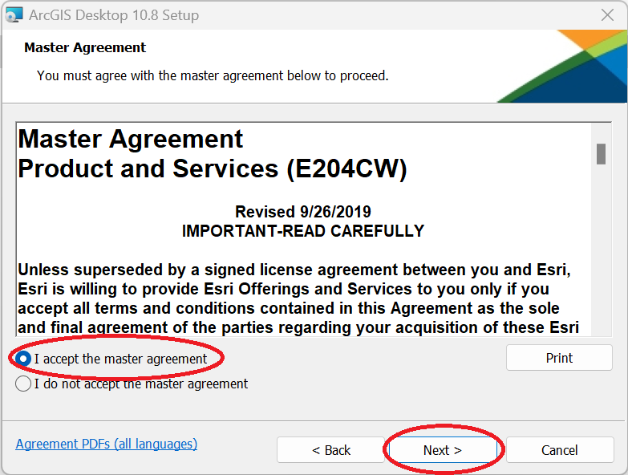
	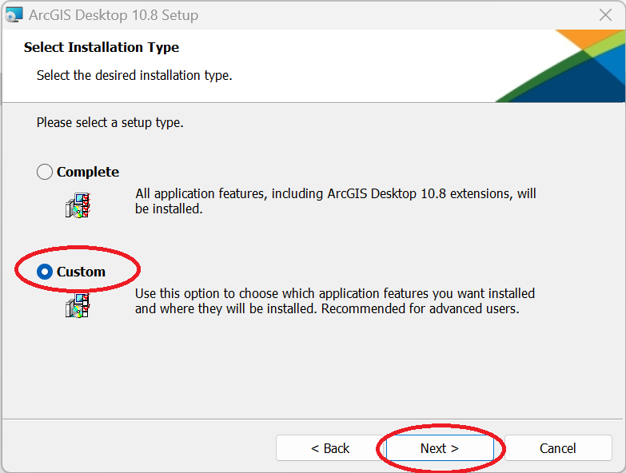
	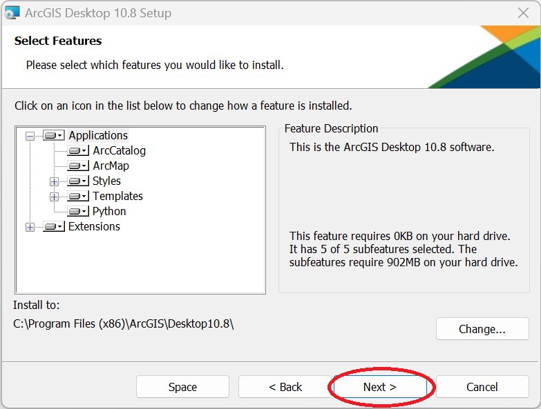
	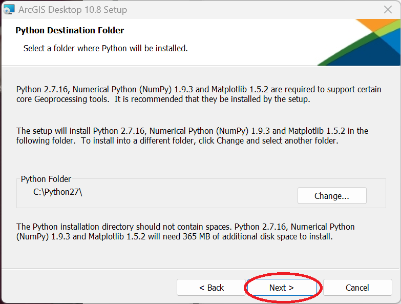
	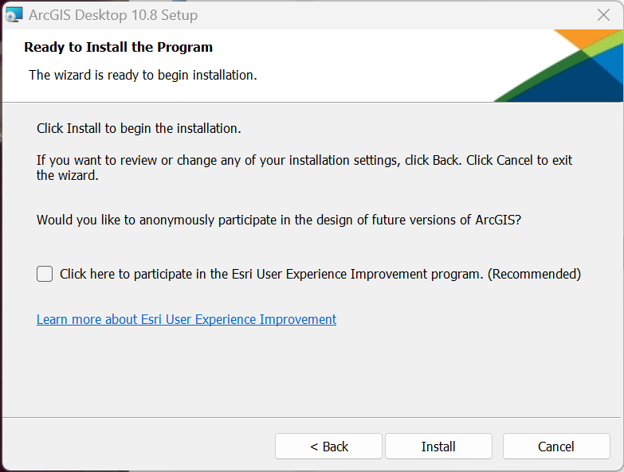
	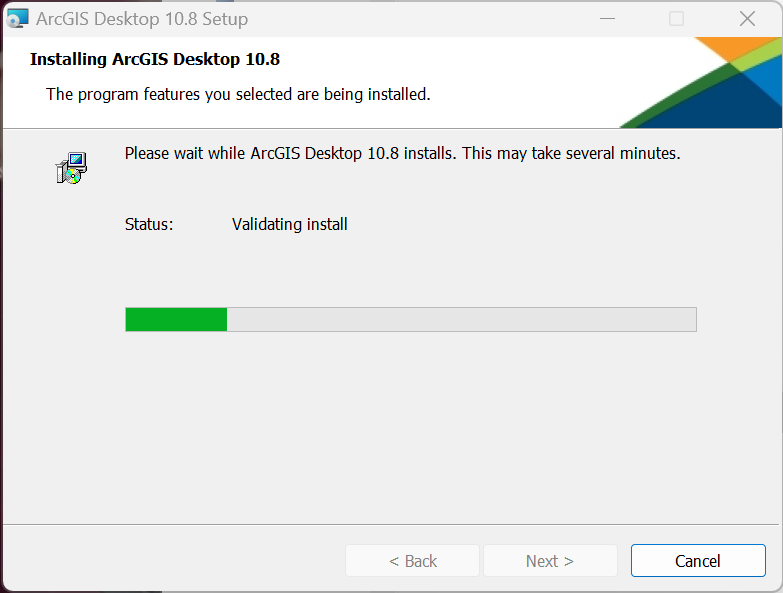
	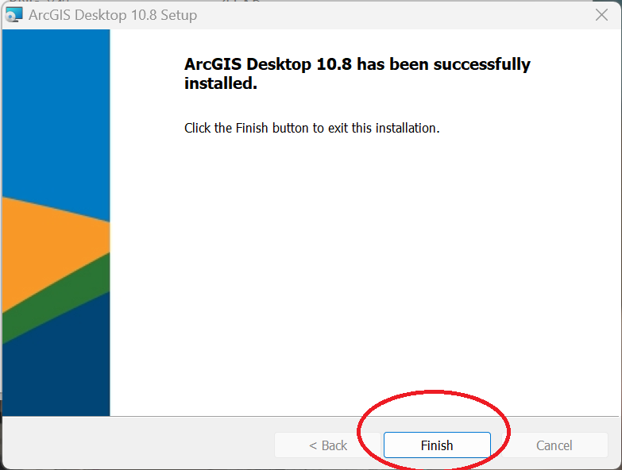
	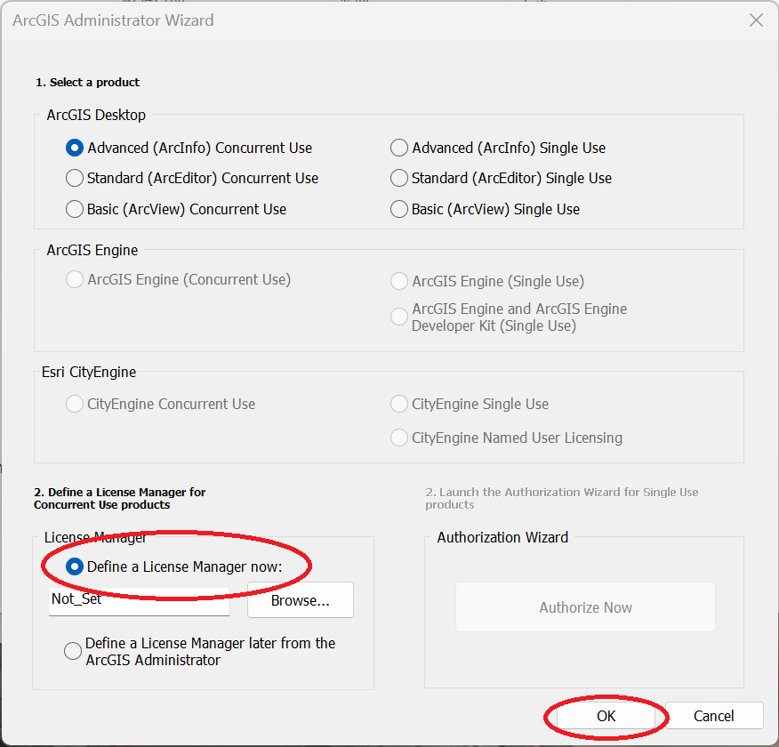
	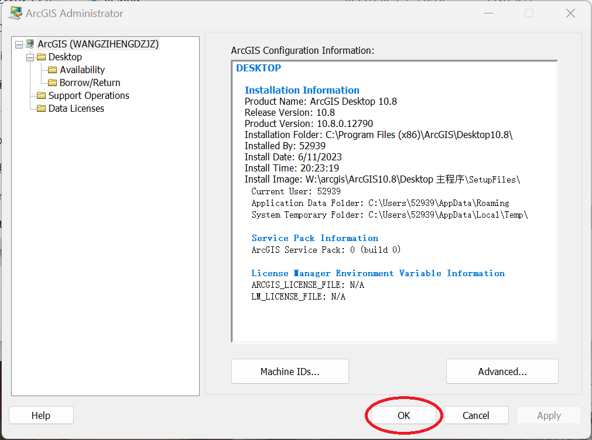
 
## 3 破解  
- 将 `.\patched\AfCore.dll` 复制到安装目录 `C:\Program Files (x86)\ArcGIS\Desktop10.8\bin` ，替换掉原来的 `AfCore.dll` 。
	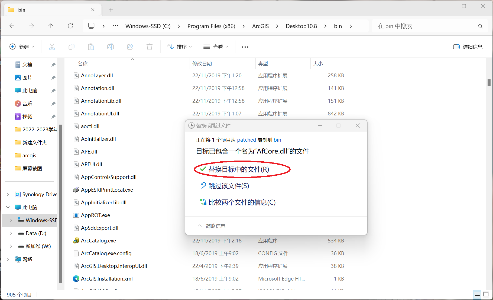
    
## 4 汉化
- 双击 `.\DesktopChinese_CN.msi` ,等待安装完成即可。

## 5 运行

- windows开始菜单找到 `ArcMap 10.8` ，单击即可打开。 
   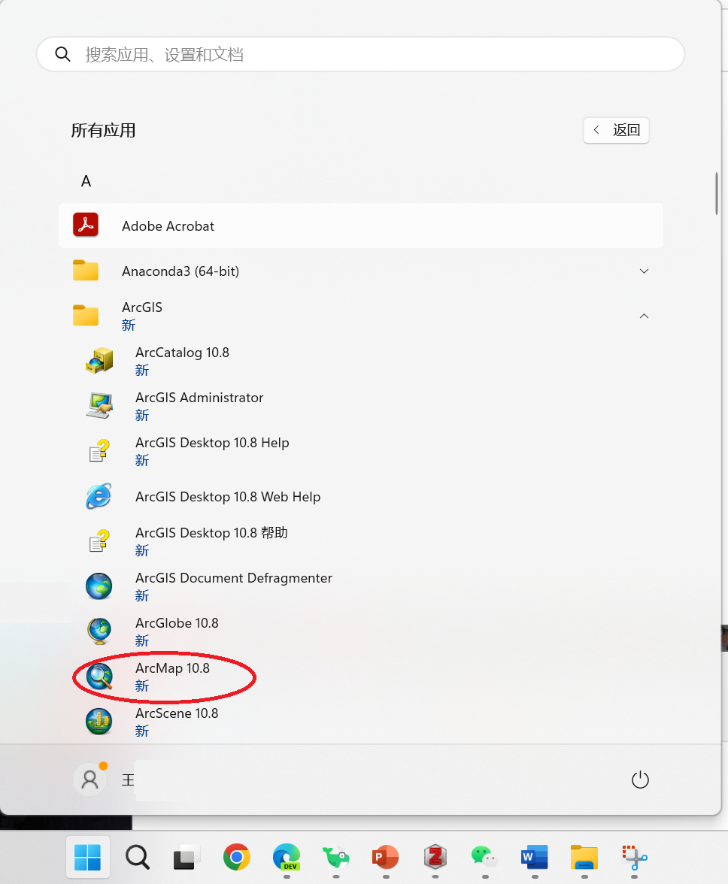

