# SKUA-GOCAD 17.0安装

1. 下载压缩包并解压出文件夹 `Paradigm SKUA-GOCAD 2017 x64` ，链接 [百度网盘](https://pan.baidu.com/s/1K6GXS6v8La47Uyj3zA405w?pwd=zdem) 提取码：`zdem` 
	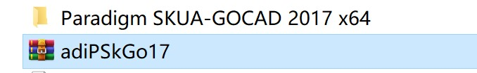
2. 打开文件夹，双击运行 `SKUA-GOCAD-17-Windows-x64.msi` 安装程序  
    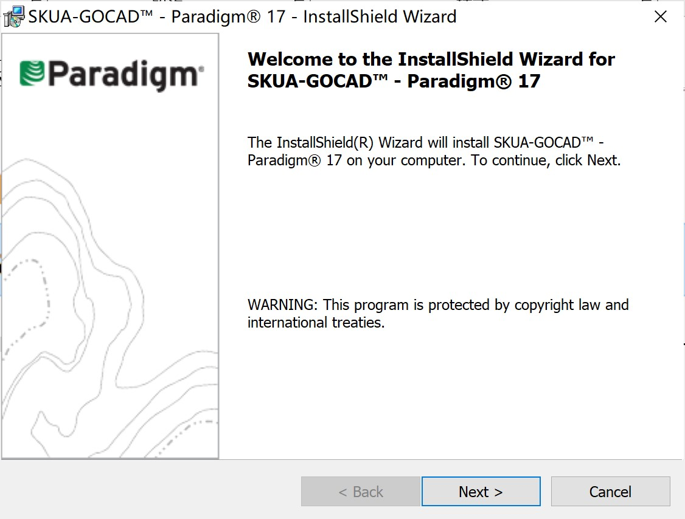
3. 按照提示点击next，选择默认安装路径为 `C:\Program Files\Paradigm\SKUA-GOCAD-17` ，根据提示点击next  
    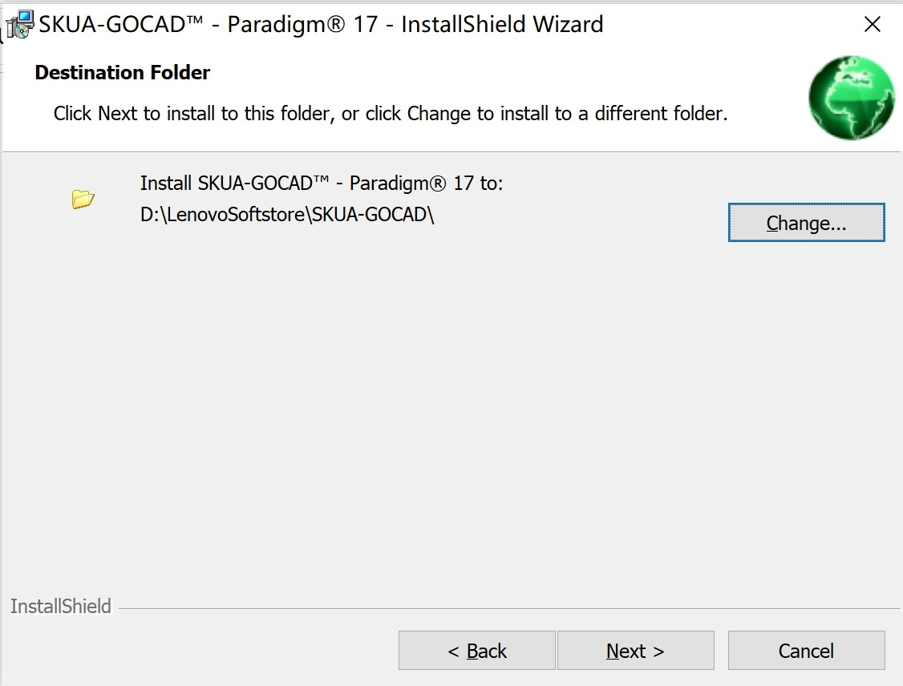
4. 根据提示点击install  
    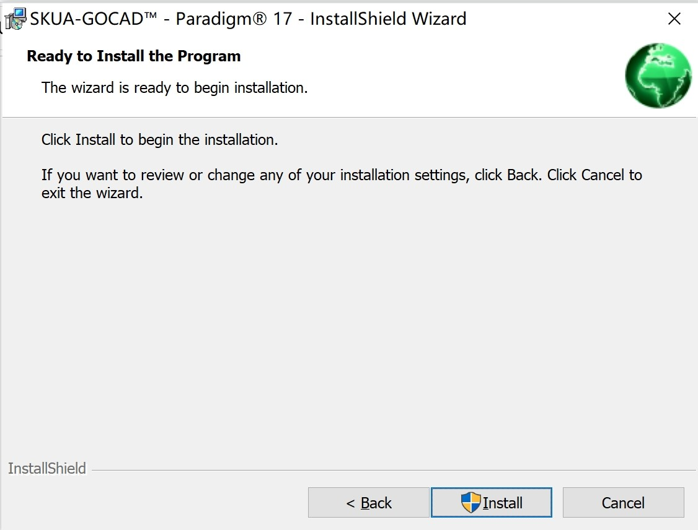
5. 安装完成后点Finish  
    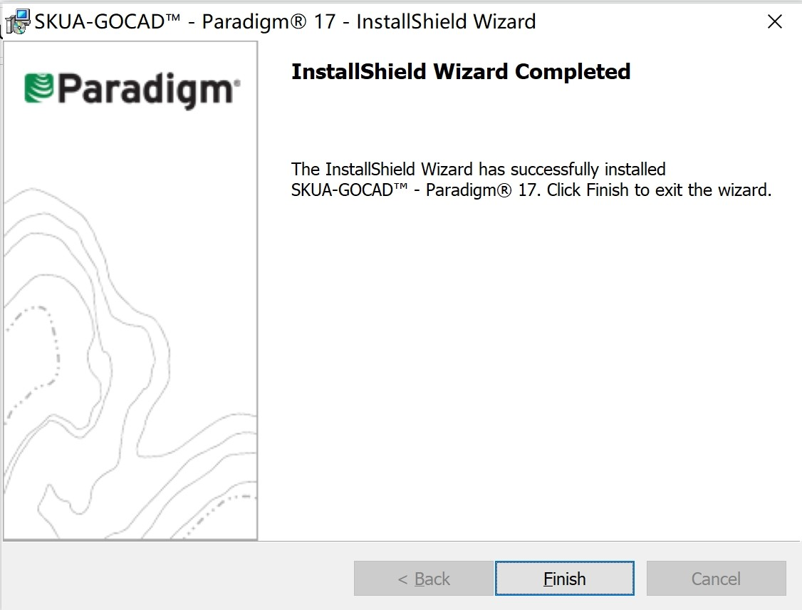
6. **破解**。打开 `Crack` 文件夹,将其中的 `PGILc.dll` 文件复制到软件安装路径默认为 `C:\Program Files\Paradigm\SKUA-GOCAD-17\Gocad\bin\Win_x64_6.1_v12` 中覆盖源文件  
    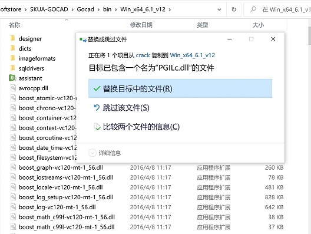	
7. 在C盘根目录下新建flexlm文件夹。  
    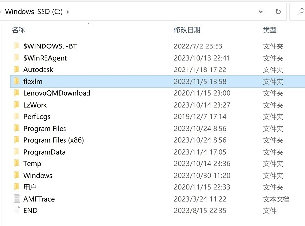
8. 将Crack中的license.dat文件复制到C:\flexlm中，如下图所示  
	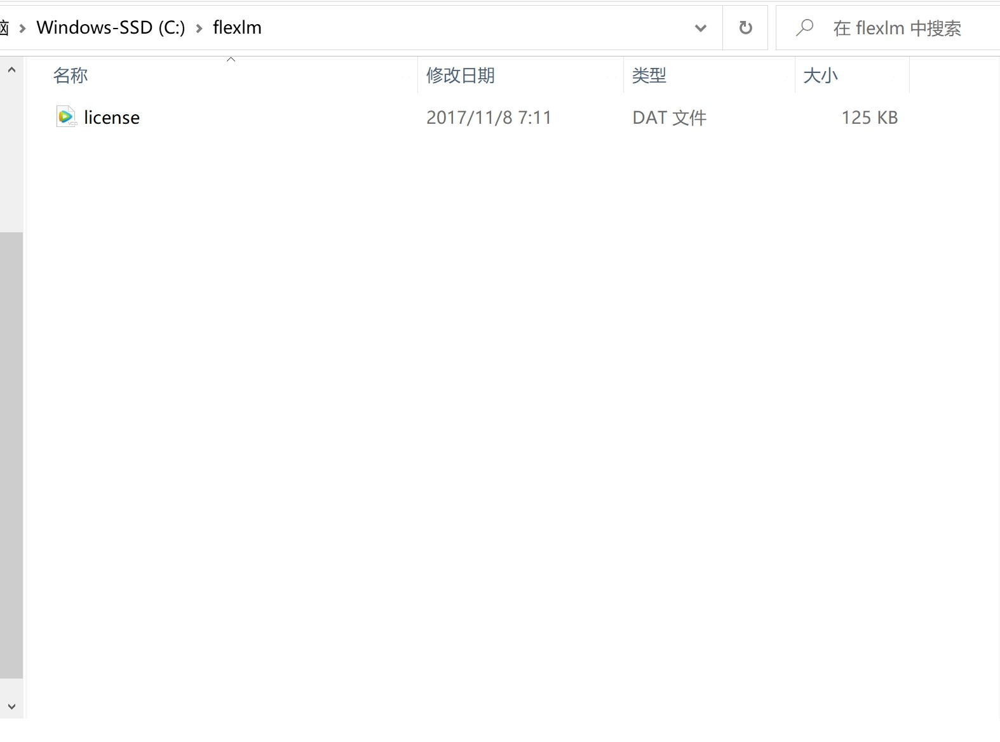
9. SKUA-GOCAD 17.0软件安装完成，双击桌面图标打开软件  
	
10. 点击New Project新建项目,自定义项目名称  
	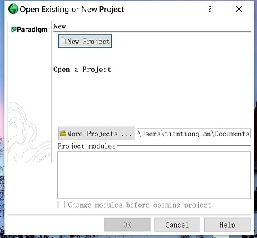
11. 点击Select All加载所有模块  
	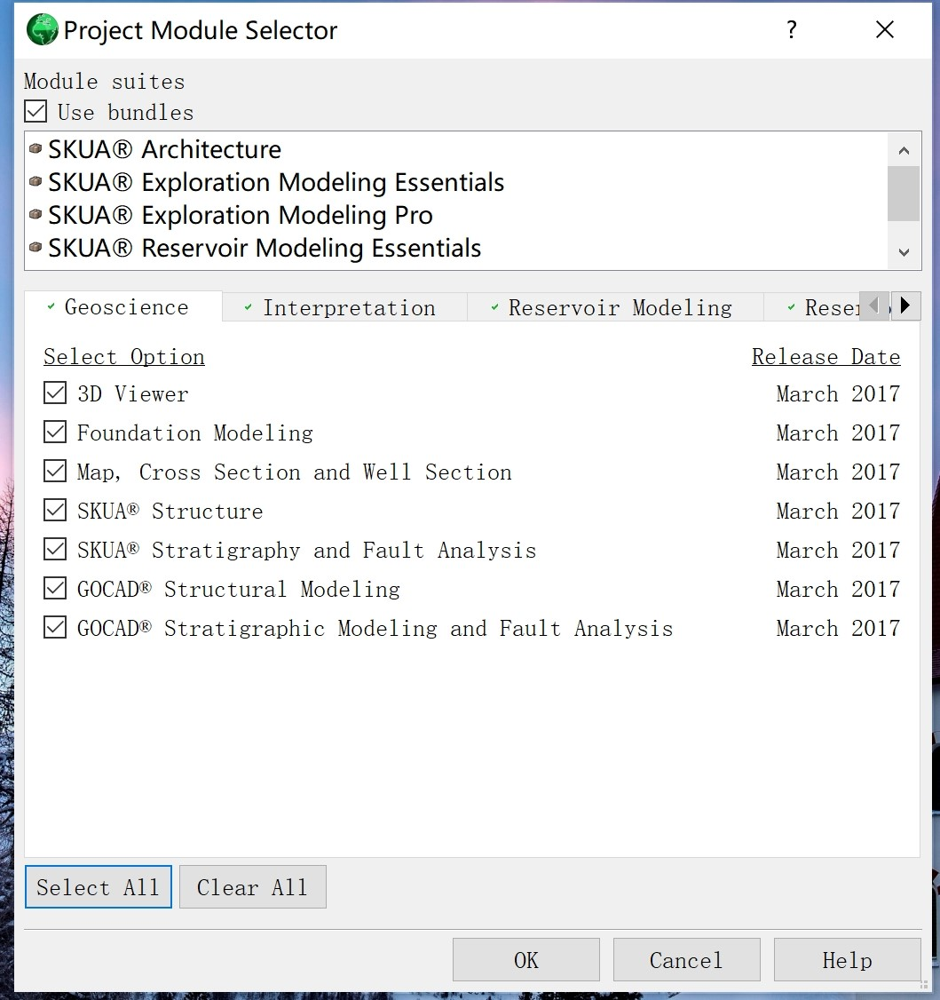
12. 开始使用。  
	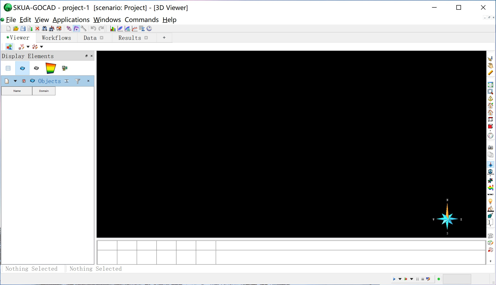
	
**致谢：** 朱素芹（GoCAD）